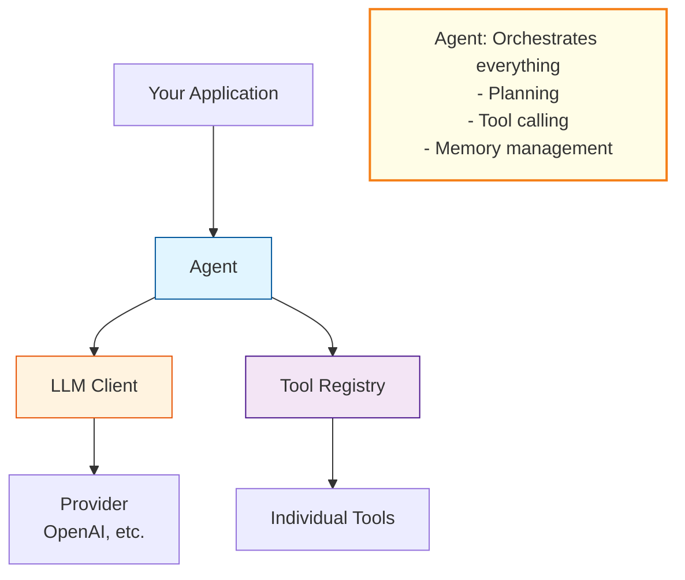
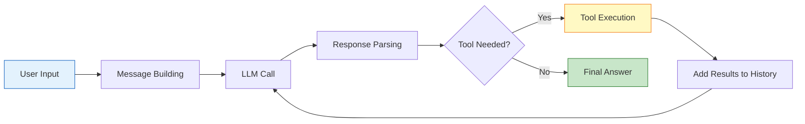
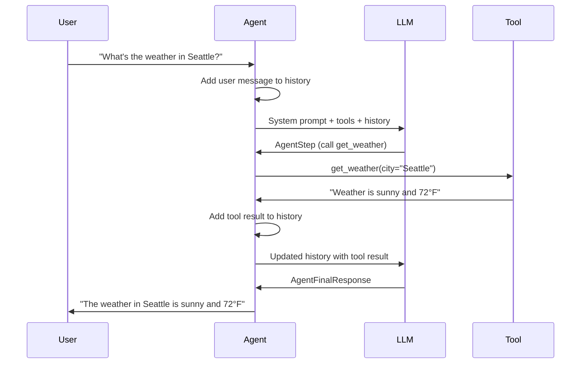

# Core Concepts

This guide explains the fundamental concepts and architecture of Acton Agent. Understanding these concepts will help you build more sophisticated agents.

## Table of Contents

- [Architecture Overview](#architecture-overview)
- [The Agent](#the-agent)
- [LLM Clients](#llm-clients)
- [Tools](#tools)
- [Messages and Conversation History](#messages-and-conversation-history)
- [Memory Management](#memory-management)
- [Response Types](#response-types)
- [Streaming Events](#streaming-events)

## Architecture Overview

Acton Agent follows a modular architecture with clear separation of concerns:



### Key Design Principles

1. **Protocol-based**: Use Python protocols for flexibility
2. **Composable**: Mix and match components
3. **Extensible**: Easy to add custom implementations
4. **Type-safe**: Leverages Pydantic for data validation
5. **Configurable**: Control logging, retries, and memory behavior

## The Agent

The `Agent` class is the central orchestrator that coordinates LLM calls, tool execution, and conversation management.

### Agent Lifecycle

```python
from acton_agent import Agent
from acton_agent.client import OpenAIClient

# 1. Initialize
client = OpenAIClient(model="gpt-4o")
agent = Agent(llm_client=client)

# 2. Register tools (optional)
agent.register_tool(my_tool)

# 3. Run conversations
response = agent.run("User query here")

# 4. Continue conversation (maintains history)
response2 = agent.run("Follow-up question")

# 5. Reset when needed
agent.reset()  # Clears conversation history
```

### How Agents Work

When you call `agent.run(user_input)`:



**Process Details:**
1. **Message Building**: Constructs the message list including system prompt, tools, and history
2. **LLM Call**: Sends messages to the LLM and receives a response
3. **Response Parsing**: Parses the response into AgentPlan, AgentStep, or AgentFinalResponse
4. **Tool Execution**: If tools are needed, executes them and adds results to history
5. **Iteration**: Repeats until a final answer is produced or max iterations reached

### Example: Understanding Agent Flow

```python
from acton_agent import Agent, FunctionTool
from acton_agent.client import OpenAIClient

def get_weather(city: str) -> str:
    """Simulated weather lookup."""
    return f"The weather in {city} is sunny and 72°F"

client = OpenAIClient(model="gpt-4o")
agent = Agent(llm_client=client, max_iterations=5)

weather_tool = FunctionTool(
    name="get_weather",
    description="Get current weather for a city",
    func=get_weather,
    schema={
        "type": "object",
        "properties": {"city": {"type": "string"}},
        "required": ["city"]
    }
)

agent.register_tool(weather_tool)

# Agent flow when you run this:
result = agent.run("What's the weather in Seattle?")
```

**Behind the scenes:**



## LLM Clients

LLM clients implement the `LLMClient` protocol, providing a consistent interface regardless of the underlying provider.

### The LLMClient Protocol

```python
from typing import Protocol, List
from acton_agent.agent import Message

class LLMClient(Protocol):
    def call(self, messages: List[Message], **kwargs) -> str:
        """Send messages to LLM and return response."""
        ...
```

### Built-in Clients

#### OpenAIClient

For OpenAI and OpenAI-compatible APIs:

```python
from acton_agent.client import OpenAIClient

# Standard OpenAI
client = OpenAIClient(
    api_key="sk-...",
    model="gpt-4o",
    base_url="https://api.openai.com/v1"  # default
)

# OpenAI-compatible (e.g., local models)
client = OpenAIClient(
    api_key="not-needed",
    model="llama-3-70b",
    base_url="http://localhost:8000/v1"
)
```

#### OpenRouterClient

For accessing multiple models through OpenRouter:

```python
from acton_agent import OpenRouterClient

client = OpenRouterClient(
    api_key="sk-or-...",
    model="anthropic/claude-3-opus",
    site_url="https://myapp.com",  # Optional: for rankings
    app_name="My App"              # Optional: for rankings
)
```

### Creating Custom Clients

Implement the `LLMClient` protocol:

```python
from typing import List
from acton_agent.agent import Message

class MyCustomClient:
    def __init__(self, endpoint: str):
        self.endpoint = endpoint

    def call(self, messages: List[Message], **kwargs) -> str:
        # Your implementation here
        # Convert messages to your API format
        # Make API call
        # Return response string
        pass

# Use with Agent
agent = Agent(llm_client=MyCustomClient("http://my-llm.com"))
```

## Tools

Tools are functions or API endpoints that agents can invoke to gather information or perform actions.

### Tool Types

Acton Agent supports three types of tools:

#### 1. FunctionTool

Wraps Python functions:

```python
from acton_agent import FunctionTool

def search(query: str, limit: int = 10) -> str:
    """Search for information."""
    # Your search implementation
    return f"Found {limit} results for '{query}'"

tool = FunctionTool(
    name="search",
    description="Search for information on the web",
    func=search,
    schema={
        "type": "object",
        "properties": {
            "query": {"type": "string", "description": "Search query"},
            "limit": {"type": "integer", "description": "Max results", "default": 10}
        },
        "required": ["query"]
    }
)
```

#### 2. HTTP Requests with FunctionTool

Make HTTP API calls using FunctionTool with Python's standard library:

```python
from acton_agent import FunctionTool
from urllib.request import Request, urlopen
import json

def get_user(user_id: int) -> str:
    """Fetch user information by ID."""
    url = f"https://api.example.com/users/{user_id}"
    req = Request(url)
    with urlopen(req) as response:
        data = json.loads(response.read().decode())
        return json.dumps(data)

tool = FunctionTool(
    name="get_user",
    description="Fetch user information by ID",
    func=get_user,
    schema={
        "type": "object",
        "properties": {
            "user_id": {"type": "integer", "description": "User ID"}
        },
        "required": ["user_id"]
    }
)
```

#### 3. Custom Tool Classes

Inherit from the `Tool` base class:

```python
from acton_agent import Tool
from typing import Dict, Any

class DatabaseTool(Tool):
    def __init__(self, connection_string: str):
        super().__init__(
            name="query_database",
            description="Query the database with SQL"
        )
        self.connection_string = connection_string

    def execute(self, parameters: Dict[str, Any]) -> str:
        query = parameters.get("query", "")
        # Execute database query
        # Return results as string
        return "Query results..."

    def get_schema(self) -> Dict[str, Any]:
        return {
            "type": "object",
            "properties": {
                "query": {"type": "string", "description": "SQL query"}
            },
            "required": ["query"]
        }
```

### ToolSets

ToolSets allow you to group related tools together with a shared description. This is useful for organizing tools by domain or functionality, and helps the LLM understand the context and purpose of groups of tools.

```python
from acton_agent import ToolSet, FunctionTool

# Create tools
def get_weather(city: str) -> str:
    """Get current weather for a city."""
    return f"Weather in {city}: Sunny, 72°F"

def get_forecast(city: str, days: int = 3) -> str:
    """Get weather forecast for a city."""
    return f"{days}-day forecast for {city}: ..."

# Create a toolset
weather_toolset = ToolSet(
    name="weather_tools",
    description="Tools for fetching and analyzing weather data",
    tools=[
        FunctionTool(
            name="get_weather",
            description="Get current weather for a city",
            func=get_weather,
            schema={
                "type": "object",
                "properties": {"city": {"type": "string"}},
                "required": ["city"]
            }
        ),
        FunctionTool(
            name="get_forecast",
            description="Get weather forecast",
            func=get_forecast,
            schema={
                "type": "object",
                "properties": {
                    "city": {"type": "string"},
                    "days": {"type": "integer", "default": 3}
                },
                "required": ["city"]
            }
        )
    ]
)

# Register the entire toolset
agent.register_toolset(weather_toolset)
```

**Benefits of ToolSets:**
- **Organization**: Group related tools together
- **Context**: Provide shared description for related functionality
- **Management**: Register/unregister multiple tools at once
- **Clarity**: Help LLM understand tool relationships and purpose

**ToolSet Operations:**
```python
# Register a toolset
agent.register_toolset(my_toolset)

# List toolsets
toolsets = agent.tool_registry.list_toolsets()

# Unregister a toolset (removes all its tools)
agent.tool_registry.unregister_toolset("weather_tools")
```

### ToolSet Parameters

ToolSets support `config` - hidden parameters that are automatically injected into all tools in the toolset during execution. These parameters are not visible to the LLM but are merged with user-provided parameters when tools are called.

This is particularly useful for:
- **API credentials**: Pass API keys without exposing them to the LLM
- **Configuration**: Share common settings across related tools
- **Context**: Provide runtime context like user IDs, session data, etc.

```python
from acton_agent import ToolSet, FunctionTool

# Define tools that use an API key
def get_weather(city: str, api_key: str) -> str:
    """Fetch weather using the API key."""
    # api_key will be automatically injected from config
    # The LLM only needs to provide the 'city' parameter
    return f"Weather in {city}: Sunny (fetched with key: {api_key[:8]}...)"

def get_forecast(city: str, days: int, api_key: str) -> str:
    """Fetch forecast using the API key."""
    return f"{days}-day forecast for {city} (using API key)"

# Create toolset with hidden parameters
weather_toolset = ToolSet(
    name="weather_api",
    description="Weather data from external API",
    tools=[
        FunctionTool(
            name="current_weather",
            description="Get current weather for a city",
            func=get_weather,
            schema={
                "type": "object",
                "properties": {
                    "city": {"type": "string", "description": "City name"}
                },
                "required": ["city"]
                # Note: 'api_key' is NOT in the schema - it's hidden from LLM
            }
        ),
        FunctionTool(
            name="forecast",
            description="Get weather forecast",
            func=get_forecast,
            schema={
                "type": "object",
                "properties": {
                    "city": {"type": "string"},
                    "days": {"type": "integer"}
                },
                "required": ["city", "days"]
                # Note: 'api_key' is NOT in the schema
            }
        )
    ],
    config={"api_key": "secret-api-key-12345"}  # Hidden from LLM
)

agent.register_toolset(weather_toolset)

# When the LLM calls the tool:
# LLM provides: {"city": "Seattle"}
# Tool receives: {"city": "Seattle", "api_key": "secret-api-key-12345"}
```

**How Parameter Merging Works:**
1. The LLM calls a tool with visible parameters (e.g., `{"city": "Paris"}`)
2. The ToolRegistry checks if the tool belongs to a ToolSet with `config`
3. Parameters are merged: `config` are added first, then LLM parameters override if there's a conflict
4. The merged parameters are passed to the tool's `execute()` method

**Example with Override:**
```python
# If config has: {"api_key": "default-key", "timeout": 30}
# And LLM provides: {"city": "Paris", "timeout": 60}
# Tool receives: {"api_key": "default-key", "timeout": 60, "city": "Paris"}
# Note: LLM's timeout (60) overrides the toolset's timeout (30)
```

### Tool Registry

Agents maintain a `ToolRegistry` that manages all registered tools and toolsets:

```python
# Register a tool
agent.register_tool(my_tool)

# Register a toolset
agent.register_toolset(my_toolset)

# List registered tools
tool_names = agent.list_tools()  # Returns: ["tool1", "tool2"]

# Unregister a tool
agent.unregister_tool("tool_name")

# Check if tool exists
if "calculator" in agent.tool_registry:
    print("Calculator is available")
```

### Tool Schemas

Tool schemas follow JSON Schema format and describe the parameters:

```python
schema = {
    "type": "object",
    "properties": {
        "city": {
            "type": "string",
            "description": "City name"
        },
        "units": {
            "type": "string",
            "description": "Temperature units",
            "enum": ["celsius", "fahrenheit"],
            "default": "celsius"
        }
    },
    "required": ["city"]
}
```

**Key Elements:**
- `type`: Always "object" for tool parameters
- `properties`: Defines each parameter
- `required`: List of required parameter names
- `description`: Helps LLM understand parameter purpose
- `enum`: Restricts to specific values
- `default`: Default value if not provided

## Messages and Conversation History

Messages represent the conversation between user, assistant, and system.

### Message Structure

```python
from acton_agent.agent import Message

# User message
user_msg = Message(role="user", content="What's the weather?")

# Assistant message
assistant_msg = Message(role="assistant", content="Let me check...")

# System message (typically set automatically)
system_msg = Message(role="system", content="You are a helpful assistant.")
```

### Conversation History

The agent maintains conversation history automatically:

```python
agent = Agent(llm_client=client)

# First interaction
agent.run("What is 2+2?")

# History now contains:
# [Message(role="user", content="What is 2+2?"),
#  Message(role="assistant", content="...")]

# Second interaction continues the conversation
agent.run("What about 3+3?")

# Agent has full context of previous conversation

# View history
history = agent.get_conversation_history()
for msg in history:
    print(f"{msg.role}: {msg.content[:50]}...")

# Reset to start fresh
agent.reset()
```

### Manual History Management

```python
# Add messages manually
agent.add_message("user", "Custom user message")
agent.add_message("assistant", "Custom assistant response")

# Get and manipulate history
history = agent.get_conversation_history()
# Modify as needed (be careful!)

# Clear history
agent.reset()
```

## Memory Management

Memory management controls how conversation history is maintained within token limits.

### The AgentMemory Protocol

```python
from abc import ABC, abstractmethod
from typing import List
from acton_agent.agent import Message

class AgentMemory(ABC):
    @abstractmethod
    def manage_history(self, history: List[Message]) -> List[Message]:
        """Process history to fit within limits."""
        pass
```

### SimpleAgentMemory

Built-in token-based truncation:

```python
from acton_agent import SimpleAgentMemory

# Create memory manager
memory = SimpleAgentMemory(max_history_tokens=8000)

# Use with agent
agent = Agent(llm_client=client, memory=memory)
```

**How it works:**
- Estimates tokens using ~4 characters per token
- When limit exceeded, removes oldest messages
- Always preserves at least the 2 most recent messages
- Automatically applied before each LLM call

### Example: Memory in Action

```python
from acton_agent import Agent, SimpleAgentMemory
from acton_agent.client import OpenAIClient

client = OpenAIClient(model="gpt-4o")
memory = SimpleAgentMemory(max_history_tokens=100)  # Very small for demo
agent = Agent(llm_client=client, memory=memory)

# Add many messages
for i in range(20):
    agent.run(f"Tell me about topic {i}")

# Only recent messages are kept in context
history = agent.get_conversation_history()
print(f"Kept {len(history)} messages in history")
```

### Disabling Memory Management

```python
# No automatic memory management
agent = Agent(llm_client=client, memory=None)
```

### Creating Custom Memory

Implement the `AgentMemory` protocol:

```python
from acton_agent.agent import AgentMemory, Message
from typing import List

class SummarizingMemory(AgentMemory):
    def __init__(self, max_messages: int = 10):
        self.max_messages = max_messages

    def manage_history(self, history: List[Message]) -> List[Message]:
        if len(history) <= self.max_messages:
            return history

        # Keep first (important context) and last messages
        # Summarize the middle
        first_few = history[:2]
        last_few = history[-2:]

        # Create summary message (simplified)
        summary = Message(
            role="system",
            content="[Previous conversation summarized...]"
        )

        return first_few + [summary] + last_few

# Use custom memory
agent = Agent(llm_client=client, memory=SummarizingMemory())
```

## Response Types

The agent can produce three types of responses during execution:

### AgentPlan

Initial planning step where the agent outlines its approach:

```python
from acton_agent.agent import AgentPlan

plan = AgentPlan(
    plan="1. Call weather API for Seattle\n2. Format the response\n3. Provide answer"
)
```

### AgentStep

Intermediate step with tool calls:

```python
from acton_agent.agent import AgentStep, ToolCall

step = AgentStep(
    tool_thought="I need to get the weather for Seattle",
    tool_calls=[
        ToolCall(
            id="call_123",
            tool_name="get_weather",
            parameters={"city": "Seattle"}
        )
    ]
)
```

### AgentFinalResponse

Final answer to the user:

```python
from acton_agent.agent import AgentFinalResponse

response = AgentFinalResponse(
    final_answer="The weather in Seattle is sunny and 72°F."
)
```

## Streaming Events

When using `agent.run_stream()`, you receive structured events:

### Event Types

```python
from acton_agent.agent import (
    AgentStreamStart,      # LLM stream begins
    AgentToken,            # Individual token/chunk
    AgentStreamEnd,        # LLM stream ends
    AgentPlanEvent,        # Agent created a plan
    AgentStepEvent,        # Agent executing tools
    AgentToolResultsEvent, # Tool results available
    AgentFinalResponseEvent # Final answer ready
)

for event in agent.run_stream("Tell me about Python"):
    if isinstance(event, AgentToken):
        print(event.content, end="", flush=True)
    elif isinstance(event, AgentFinalResponseEvent):
        print(f"\n\nFinal: {event.response.final_answer}")
```

### Streaming Example

```python
from acton_agent import Agent
from acton_agent.client import OpenAIClient

client = OpenAIClient(model="gpt-4o")
agent = Agent(llm_client=client, stream=True)

print("Agent response: ", end="", flush=True)
for event in agent.run_stream("Write a haiku about coding"):
    if isinstance(event, AgentToken):
        print(event.content, end="", flush=True)
print("\n")
```

**Output:**
```
Agent response: Lines of code flow,
Logic weaves through the silence,
Programs come alive.
```

## Key Terminology

| Term | Description |
|------|-------------|
| **Agent** | Orchestrator that manages LLM calls, tools, and conversation |
| **Tool** | Function or API that the agent can invoke |
| **LLM Client** | Interface to language model providers |
| **Message** | Single conversation entry (user/assistant/system) |
| **Memory** | System for managing conversation history within limits |
| **Tool Call** | Request to execute a tool with specific parameters |
| **Tool Result** | Output from executing a tool |
| **Iteration** | One cycle of LLM call + optional tool execution |

## Design Philosophy

Acton Agent is built on these principles:

1. **Simplicity First**: Easy to get started, powerful when needed
2. **Composability**: Mix and match components
3. **Type Safety**: Leverage Python typing and Pydantic
4. **Observability**: Configurable logging for debugging and monitoring
5. **Extensibility**: Easy to customize any component
6. **Reliability**: Retry logic, error handling, memory management

## Next Steps

- **[API Reference](api-reference.md)** - Detailed API documentation
- **[Examples](examples/)** - Practical code examples
